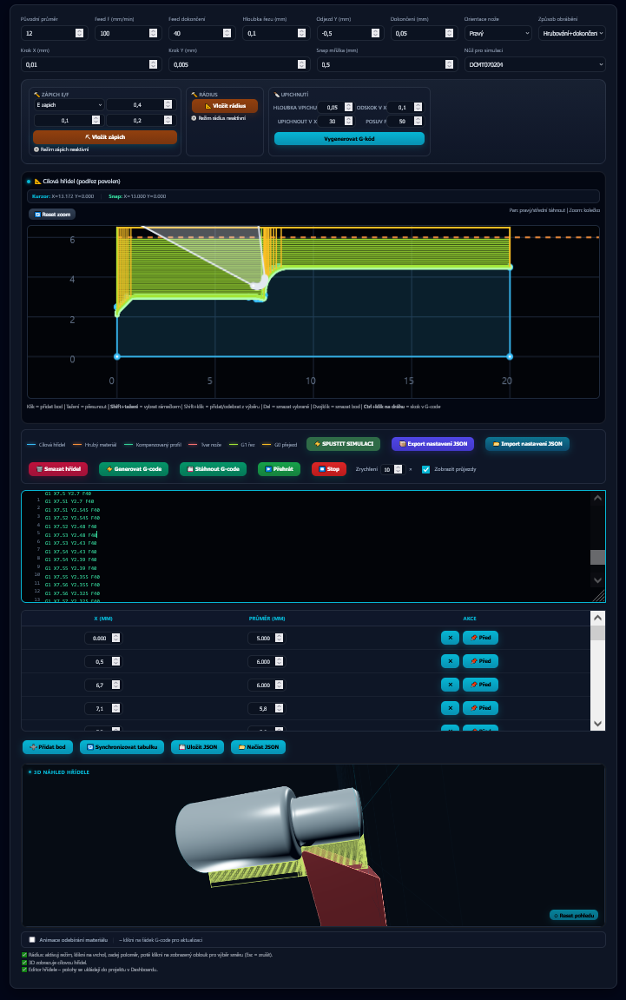
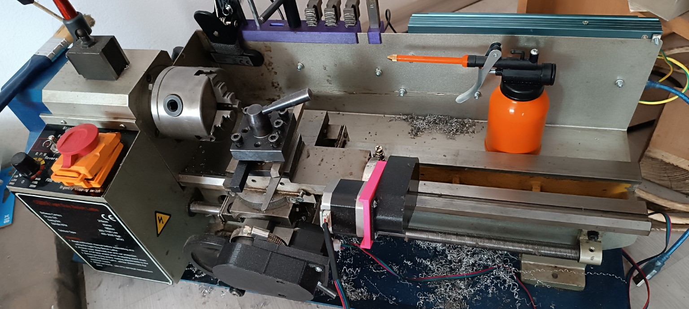
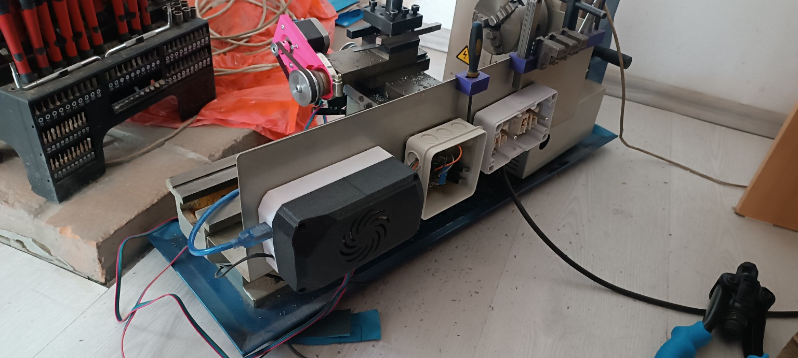
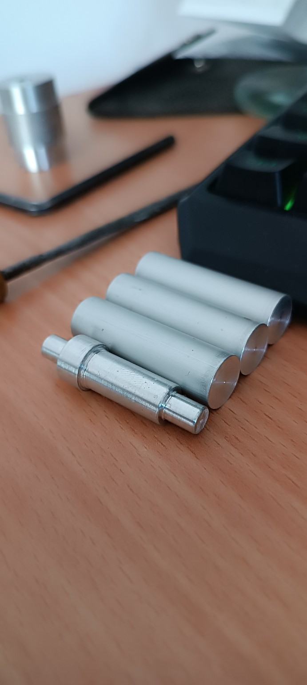

# KidCAM Lathe

Browser-based CAM software and open-source CNC lathe designed for STEM education.

## Overview

KidCAM Lathe is an educational CNC turning platform created to make computer-controlled machining accessible to children and beginners.

The project combines:

* A GRBL-based CNC lathe
* A browser-based CAM application written in HTML, CSS and JavaScript
* Visual machining simulation
* Educational materials for STEM programs

Unlike traditional industrial CAM software, KidCAM focuses on simplicity, safety and learning.

No installation is required. The software runs directly in a web browser and can be used on school computers, Chromebooks or tablets.

---

## Project Goals

The primary goal is to introduce students to:

* CNC machining
* Programming logic
* Engineering principles
* Digital manufacturing
* Problem solving

Students can design a simple turned part, generate G-code and watch the machine create the physical object.

---

## Current Status

### Hardware

✅ Fully operational CNC lathe

✅ GRBL controller

✅ Stepper motor driven axes

✅ Emergency stop system

✅ Educational workshop deployment planned

### Software

✅ Browser-based CAM application

✅ G-code generation

✅ Tool nose radius compensation

✅ Roughing and finishing operations

✅ Part profile editor

✅ Project save/load

✅ JSON export/import

✅ 2D toolpath visualization

✅ 3D workpiece rendering

✅ Machining simulation

---

## Screenshots

### CAM Interface

### CNC Lathe

### Electronics

### Example Parts

---

## Educational Deployment

The first public deployment is planned for STEM summer camps.

Expected impact:

* 2 camp sessions
* Approximately 50 students
* Hands-on CNC manufacturing experience
* Introduction to programming and engineering concepts

The project is designed to provide a safe and approachable path into CNC machining for young learners.

---

## Roadmap

### Version 0.9

* Advanced validation system
* Machine safety limits
* Better error detection
* Improved UI workflow

### Version 1.0

* Classroom mode
* Interactive tutorials
* Guided projects
* Multi-language support

### Future

* Complete educational package
* Lesson plans
* Assembly instructions
* Hardware BOM
* Community contributions

---

## Technology

### Hardware

* Mini lathe platform
* GRBL motion controller
* Stepper motors
* Custom mounting components
* 3D printed accessories

### Software

* HTML5
* CSS3
* JavaScript
* Canvas rendering
* WebGL 3D visualization

---

## Open Source Commitment

After educational testing and validation, the complete project will be published as open source, including:

* Source code
* Hardware modifications
* Bill of materials
* Documentation
* Educational worksheets

The goal is to enable schools, makerspaces and hobbyists worldwide to build their own educational CNC turning platform.

---

## Contributing

Contributions, suggestions and educational feedback are welcome.

---

## License

MIT License

---

## Author

Created by Pavel Krupka

Project: KidCAM Lathe
